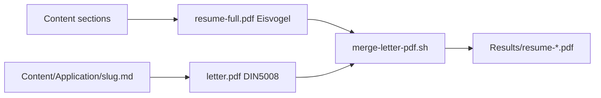

# Reference: Local cover letters

## File layout

```
Content/Application/          # gitignored – never commit
└── <slug>.md                 # one file per application

Content/Application.example/
└── example-gmbh.md           # committed template to copy
```

Slug = filename without `.md` (e.g. `acme-gmbh` → `Content/Application/acme-gmbh.md`).

## YAML front matter (`letter:`)

All fields live under a top-level `letter:` key. Use **YAML lists** for multi-line addresses.

```yaml
---
letter:
  fromname: "André Lademann"
  fromaddress:
    - Musterstraße 12
    - 04109 Leipzig
  to:
    - Example GmbH
    - z. Hd. Personalabteilung
    - Firmenallee 42
    - 10115 Berlin
  place: Leipzig
  date: 23.06.2025
  yourref: "Ihre Stellenausschreibung …"
  subject: "Bewerbung als …"
  opening: "Sehr geehrte Damen und Herren,"
  closing: "Mit freundlichen Grüßen"
  signature: "André Lademann"
---

Body paragraph one.

Body paragraph two.
```

| Field | Required | Maps to (KOMA/scrlttr2) |
|-------|----------|-------------------------|
| `fromname` | recommended | `\setkomavar{fromname}` |
| `fromaddress` | recommended | `\setkomavar{fromaddress}` (back address) |
| `to` | yes | Recipient in `\begin{letter}{…}` (first line = company name for output filename) |
| `company` | optional | Explicit company name for output filename (overrides first `to` line) |
| `place` | recommended | `\setkomavar{place}` |
| `date` | recommended | `\setkomavar{date}` |
| `yourref` | optional | `\setkomavar{yourref}` |
| `subject` | yes | `\setkomavar{subject}` |
| `opening` | optional | `\opening{…}` (default: "Sehr geehrte Damen und Herren,") |
| `closing` | optional | `\closing{…}` (default: "Mit freundlichen Grüßen") |
| `signature` | recommended | `\setkomavar{signature}` |

Markdown below the closing `---` is the letter body.

Template: `Template/letter-din5008.latex` (`scrlttr2`, option `DIN5008B`).

## Profiles

| Profile | CLI | Content overrides |
|---------|-----|-------------------|
| standard | `./Scripts/build.sh` | `Content/*.md` |
| iot | `--profile=iot` | `Content/Profiles/iot/*.md`, `.env.iot`, `defaults-pdf-iot.yml` |

Discover more profiles: `ls Content/Profiles/`.

## Build pipeline (with `--letter`)



PDF page order: **title page → cover letter → resume content** (no table of contents).

EPUB: letter body (without YAML) prepended as `# Anschreiben` before combined content; cover image unchanged.

Merge tool fallback: `qpdf` → `pdfunite`/`pdfseparate` → Docker `minidocks/qpdf`.

## Output filenames

With `RESUME_FILENAME=andrelademann` and tag `v1.2.3`:

- `Results/resume-andrelademann-v1.2.3.pdf` (standard, no letter)
- `Results/resume-andrelademann-example-gmbh-v1.2.3.pdf` (standard + letter to Example GmbH)
- `Results/resume-andrelademann-iot-acme-gmbh-v1.2.3.pdf` (iot + letter)
- `Results/resume-andrelademann-example-gmbh-v1.2.3.epub`

Company slug is derived from `letter.company` or the first `letter.to` line (umlauts normalized, lowercase, hyphenated).

## What not to commit

- `Content/Application/` (entire directory)
- `Results/` (build artifacts)
- Do not add `--letter` to `.github/workflows/build-and-release.yml`

## Optional local default

`Content/Application/.env` (gitignored):

```sh
COVER_LETTER=acme-gmbh
```

Only create or edit when the user explicitly requests it.
