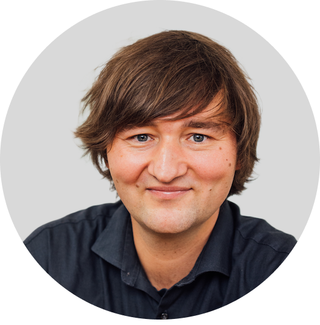
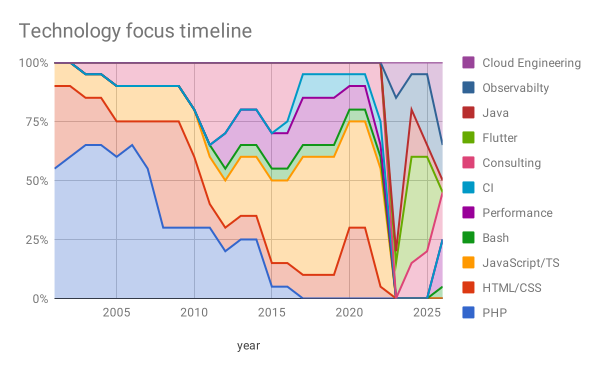

# Einführung

> [Einführung](./0-introduction.md) | [Lebenslauf](./1-curriculum-vitae.md) | [Portfolio](./2-portfolio.md) | [Kontakt](3-contact.md)

{ width=42% }

Ein Lebenslauf ist wie ein [DOM](https://developer.mozilla.org/en-US/docs/Web/API/Document_Object_Model/Introduction) – man versteht ihn erst richtig, wenn man genau hinschaut.

## Über mich

Ich bin leidenschaftlicher **Software-Engineer** und **Cloud-Engineer** mit
starker Begeisterung für Observability. In meiner Freizeit experimentiere ich mit
**Mikrocontrollern** und **autonomem Fahren**.
**Die Faszination für Software und Hardware motiviert mich, mich fortlaufend in
neue Technologien einzuarbeiten und mich mit der Community auszutauschen.**

Als **Organisator der [LoRaWAN Leipzig Usergroup][meetup-lorawan]** bringe ich
regelmäßig Entwickler, Maker und Unternehmen zusammen, um Erfahrungen rund um
IoT und LoRaWAN auszutauschen.

In meiner beruflichen Laufbahn konnte ich mit internationalen Teams arbeiten und
Projekte in verschiedenen Ländern realisieren. Im Marketing-Umfeld automatisiere
ich Prozesse, steigere Effizienz und produziere Inhalte in Bild, Text und Ton.

Mit **[regenfass.eu][regenfass]** entwickle ich ein eigenes IoT-Produkt für
Smart-Home-Anwendungen. Seit 2025 bin ich Mitgründer der
**[kieks.me GbR][kieksme]**, einer Consulting- und Freelance-GbR für
Web-Entwicklung und SaaS-Lösungen.

**Meine Fähigkeiten sind:**
1. Softwareentwicklung
2. Cloud-Engineering
3. Softwarearchitektur
4. Beratung, Trainer, Vortragender
5. Marketing, SEO, Content-Produktion

## Aufgabenschwerpunkte im Verlauf der Zeit

Im Verlauf der Zeit haben sich meine Themenschwerpunkte mehrfach verlagert.
Die folgende Grafik veranschaulicht dies gut. 2023 gab es einen starken
Fokus auf Softwareentwicklung und Cloud-Engineering. Im Jahr 2024 habe ich mich
zusätzlich auf Observability spezialisiert.

{ width=100% }

## Skills

### Softwareentwicklung

- Anwendungsentwicklung
- Performance-Optimierung
- Sicherheitstests (Penetrationstests)

### Beratung

- Projektmanagement
- Anforderungsmanagement
- Softwarearchitektur

### Trainer & Vortragender

- Softwareentwicklung
- DevOps

### Marketing

- SEO
- Webanalyse, BI
- Content-Produktion
- Automatisierung

## Technologie-Stack

Flutter, Dart, OpenTelemetry, IIoT, TypeScript, JavaScript, Usability, IaC,
Barrierefreiheit, Vue.js, Docker, Node.js, Performance, ESI, Varnish Reverse Proxy,
Deployment, Google‑Chrome‑Erweiterungen, Regressionstests, Funktionstests,
Abnahmetests, Unit-Tests, BDD, PWA, Git, Continuous Integration (CI),
Concourse CI, Firebase, TYPO3 CMS, Nginx, PHP, IoT, Raspberry Pi, Semantic
Web, RDF, Looker, ETL, Lasttests, Mobile App‑Entwicklung, Ansible, Vagrant,
Crossplane

> **Mehr davon?** In meinem [Lebenslauf](./1-curriculum-vitae.md) und
> [Portfolio](./2-portfolio.md) gehe ich auf weitere Details ein.

[meetup-lorawan]: https://www.meetup.com/de-DE/lorawan-leipzig-usergroup
[regenfass]: https://docs.regenfass.eu/
[kieksme]: https://kieks.me/