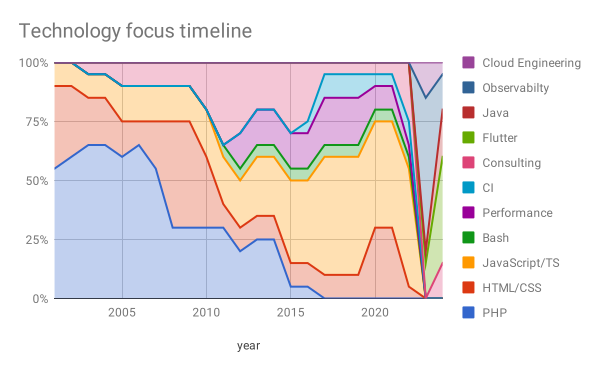

# Introduction

> [Introduction](./0-introduction.md) | [CV](./1-curriculum-vitae.md) | [Portfolio](./2-portfolio.md) | [Contact](3-contact.md)

{ width=42% }

A resume is like a [DOM](https://developer.mozilla.org/en-US/docs/Web/API/Document_Object_Model/Introduction), you never know until you really inspect it!

## Über mich

Ich bin leidenschaftlicher **Software-Engineer** und **Cloud-Engineer** mit 
einer Passion für Observability. In meiner Freizeit experimentiere ich mit 
**Mikrokontrollern** und **Autonomes Fahren** von Fahrzeugen. In 
[Meetups][meetup-lorawan], Schulungen und Workshops teile ich meine 
Erfahrungen mit Anderen und helfe ihnen, ihre eigenen Projekte zu 
realisieren. **Es ist die Faszination für Software und Hardware, die mich 
immer wieder dazu bringt, mich in neue Technologien einzuarbeiten und mich 
mit anderen Menschen auszutauschen!** In meiner beruflichen Laufbahn hatte 
ich die Möglichkeit, mit internationalen Teams zu arbeiten und Projekte in 
verschiedenen Ländern zu realisieren. Im Bereich Marketing unterstütze ich 
dabei, Prozesse zu automatisieren und die Effizienz zu steigern und 
produziere auch selbst Inhalte in Bild, Text und Ton.

**Meine Fähigkeiten sind:**
1. Software-Entwicklung
2. Cloud Engineering
3. Software-Architektur
4. Consulting, Trainer, Speaker
5. Marketing, SEO, Content-Produktion

## Aufgabenschwerpunkte im Verlaufe der Zeit

Im Verlaufe der Zeit haben sich meine Themenschwerpunkte des Öfteren verlagert.
Die folgende Grafik visualisiert dies sehr gut. 2023 geb es einen starken
Fokus auf Software-Entwicklung und Cloud-Engineering. Im Jahr 2024 habe ich
mich zusätzlich auf Observability spezialisiert.

{ width=100% }

## Skills

### Software Engineering

- Software development
- Performance optimization
- Security penetration testing

### Consulting

- Project management
- Requirement engineering
- Software architecture

### Trainer & Speaker

- Software development
- DevOps

### Marketing

- SEO
- Analytics, BI
- Content-Produktion
- Automatisierung

## Buzzword bingo

Flutter, Dart, OpenTelemetry, IIoT, TypeScript, JavaScript, Usability, IaC, 
Accessibility, Vue.js, Docker, Node.js, Performance, ESI, Varnish reverse proxy,
Deployment, Google Chrome Extensions, Regressive testing, functional testing, 
acceptance testing, unit testing, bdd, PWA, git, Continuous Integration, 
Concourse CI, Firebase, TYPO3 CMS, Nginx, PHP, IoT, Raspberry PI, Semantic 
Web, RDF, Looker, ETL, Load testing, Mobile App Development, Ansible, Vagrant, 
Crossplane

> **Mehr davon?** In meinem [CV](./1-curriculum-vitae.md) und 
> [Portfolio](./2-portfolio.md) gehe ich auf weitere Details ein.

- [meetup-lorawan]: https://www.meetup.com/de-DE/lorawan-leipzig-usergroup
