# Portfolio

> [Einführung](./0-introduction.md) | [Lebenslauf](./1-curriculum-vitae.md) | [Portfolio](./2-portfolio.md) | [Kontakt](3-contact.md)

## Projektübersicht

- **POS & Observability**
  - [EDEKA - Observability PoC](#-EDEKA-Observability-PoC) 
    Integration der Gebit-Kassenlösung für EDEKA
  - [EDEKA - Kassensoftware Integration](#-EDEKA-POS-Integration) 
    Integration der Gebit-Kassenlösung für EDEKA

- **IoT**
    - [regenfass.eu](#-regenfasseu) IoT Smart-Home-Eigenprodukt
    - [CoffeeBin](#-CoffeeBin) Datenvisualisierung und Analytics
    - [Digitaler Agenturkicker](#-Digitaler-Agenturkicker) IoT Multichannel

- **App-Entwicklung**
    - [Flughafen Leipzig/Halle Nachbarschaftsportal](#-lej-nachbarn-app) App-Entwicklung
    - [Tap!Tap!](#-tap-tap) App-Entwicklung
    - [CamFight](#-CamFight) Mobile Web App

- **Webentwicklung**
    - [kieks.me](#-kieksme) Consulting- und Freelance-GbR
    - [AIDA board portal](#-AIDA-board-portal) Gästeportal für AIDA Cruises
    - [dynamo-dresden.de](#-dynamo-dresdende) High-Performance-Webanwendung
    - [Blugento](#-blugento) Docker, Marketing-Automation, AWS

- **Desktop** (PWA)
    - [KiTa Tagesplaner](#-KiTa-Tagesplaner) PWA-App

- **CI/CD**
    - [Universal Mucis - Shop-Manager](#-universal-music--shop-manager) Schulungen, Docker, CI/CD, Cloud (AWS, Azure)
    - [Flughafen Leipzig/Halle Nachbarschaftsportal](#-lej-nachbarn-app) App-Entwicklung

- **[Weitere Projekte](#-Weitere-Projekte)**
    - [Bashlight](#-Bashlight) Kommandozeilen-Erweiterung

---

## Consulting

### [[↑](#projektübersicht)] KiTa Tagesplaner

_2020 - 2021_

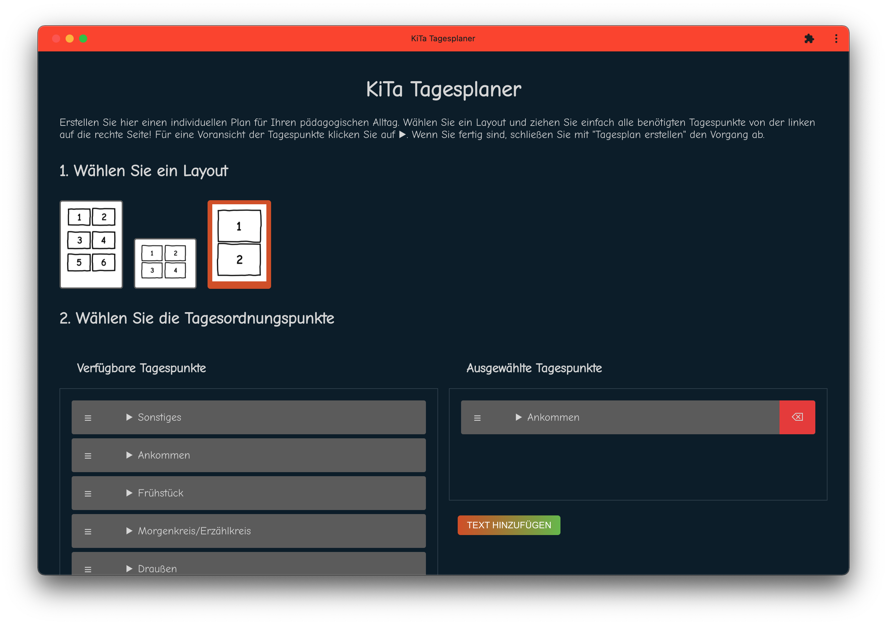

Erzieherinnen und Erziehern soll ein Werkzeug an die Hand gegeben werden, um
den Tagesablauf in der Kita mit Bildern zu beschreiben. Die Bilder können per
Drag-and-Drop ausgewählt und sortiert werden. Zusätzliche Textfelder können
eingefügt werden.

Die **Technologie-Highlights** sind *Vue.js* im Frontend mit *jspdf* für die
Erstellung von PDFs. Es handelt sich um eine einseitige Anwendung, die ohne
Internetverbindung genutzt werden kann und auf Desktop-Geräten installierbar
ist. Die Anwendung erkennt den bevorzugten Lichtmodus des Systems und ändert
das Styling in den *Dunkelmodus*, wenn dieser aktiviert ist. Sie verwendet
benutzerdefinierte Eigenschaften. Für das Backend habe ich auch eine *REST-API*
mit *OpenAPI* erstellt. [fastify](https://www.fastify.io/) war meine Wahl für
das Framework.

**Meine Aufgaben:** Full-Stack-Entwicklung, Projektmanagement, 
Softwarearchitektur, Kundenbetreuung.

| Technik-Highlights                 |                                              |
|------------------------------------|----------------------------------------------|
| [Vue.js][vue.js]                   | Mobile App mit der Vuetify-Komponentenbibliothek |
| [fastify][fastify]                 | Backend-Framework für Node.js                |
| [jspdf][jspdf]                     | PDF-Erzeugung                                |
| [OpenAPI][openapi]                 | REST-API-Generierung und Dokumentation       |
| [Heroku][heroku]                   | Bereitstellung einer REST‑API                |

| Links                              |                                                                  |
|------------------------------------|------------------------------------------------------------------|
| App                                | <https://kita-tagesplaner.onrender.com>                          |
| Repository der App                 | <https://github.com/NULLzuEINS/kindergarten-day-planner-app>     |
| Repository des Services            | <https://github.com/NULLzuEINS/kindergarten-day-planner-service> |

## Projektleitung

### [[↑](#projektübersicht)] Observability EDEKA PoC

_2023_

EDEKA möchte mehr Transparenz in seine Prozesse bringen. Viele Microservices
laufen in einem Orchester ohne Dirigenten. Mit der Observability-Plattform
wird es möglich, die Prozesse zu überwachen und bei Bedarf zu
intervenieren. In diesem PoC galt es, den Nachweis der Machbarkeit zu liefern,
dass OpenTelemetry im SAP‑Kontext eingesetzt werden kann.

**Meine Aufgaben** waren die Team- und Projektleitung. Ich habe die 
Softwarearchitektur entwickelt und die Installation der Software auf den
Demonstrationsservern durchgeführt.

Die **Technologie-Highlights** sind *OpenTelemetry* zur Überwachung der
Prozesse, *Jaeger* zur Visualisierung der Traces und *Prometheus* zur
Überwachung der Systeme sowie die Visualisierung von Traces, Metriken und Logs
in [DataDog][datadog].

| Technologische Highlights          |                |
|------------------------------------|----------------|
| [OpenTelemetry][opentelemetry]     | Im SAP‑Kontext |
| [Jaeger][jaeger]                   | Tracing        |
| [Prometheus][prometheus]           | Monitoring     |
| [DataDog][datadog]                 | Observability  |

### [[↑](#projektübersicht)] kieks.me

_2025 – heute_

**[kieks.me][kieksme]** ist eine Consulting- und Freelance-GbR für
Web-Entwicklung, SaaS-Websites, Corporate Design und Landing Pages,
die ich 2025 mitgegründet habe.

**Meine Aufgaben:** Mitgründer, Softwarearchitektur, Full-Stack-Entwicklung.

| Technologische Highlights |                           |
|---------------------------|---------------------------|
| [TypeScript][typescript]  | Frontend & Backend        |
| [Vue.js][vue.js]          | Frontend-Entwicklung      |
| [Node.js][node-red]       | Backend-Entwicklung       |

| Links   |                         |
|---------|-------------------------|
| Website | <https://kieks.me/>     |

---

### [[↑](#projektübersicht)] AIDA board portal

_2013-2016_

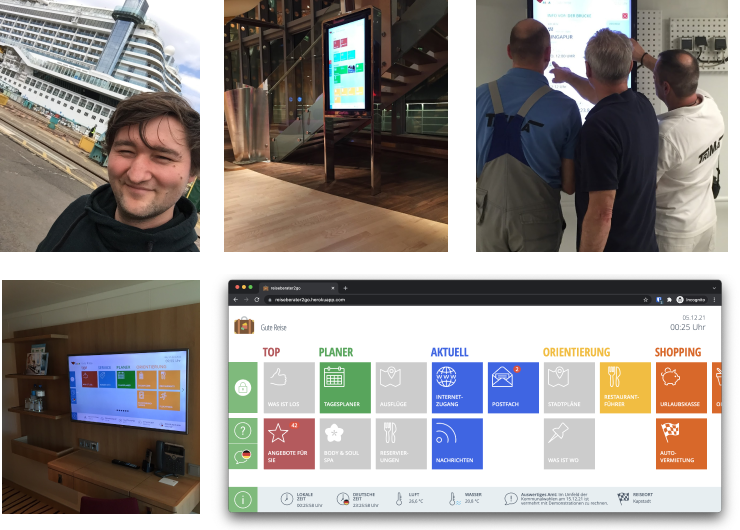

Das AIDA‑Bordportal ist auf AIDA‑Schiffen installiert und dient Gästen und
Besatzung zur Orientierung und zur Buchung von Ausflügen und Restaurantplätzen.
Es ist optimiert für TV, Mobile und spezielle Displays in den Gängen.

**Meine Aufgaben** waren die Team- und Projektleitung, die Installation der
Software auf dem Schiff und die Erstellung eines Demosystems.

Die **Technologie-Highlights** sind die Unterstützung von *Low‑Power‑Hardware*
(LG TV), *Kartenleser* zum Einloggen in Benutzerkonten, Bedienung über
*Fernbedienung*, Erstellung und Aktualisierung einer Chrome‑Erweiterung aus der
Ferne, *verschiedene APIs* auf dem Schiff (Restaurants, Ausflüge,
Terminbuchungen …)

| Technologische Highlights          |                                    |
|------------------------------------|------------------------------------|
| [Docker-Registry][docker-registry] | auf GitLab                         |
| [Docker Compose][docker-compose]   | für verschiedene Environments      |
| [AWS ECS][aws-ecs]                 | für das Container‑Deployment       |
| [AWS EC2][aws-ec2]                 | für das Container‑Deployment       |
| [AWS EFS][aws-efs]                 | zum verteilten Speichern von Daten |
| [AWS RDS][aws-rds]                 | zum Datenbank‑Deployment           |
| [Concourse CI][concourse-ci]       | als Pipeline‑Tool für CI/CD        |

| Links |                                    |
|-------|------------------------------------|
| Demo  | (nicht öffentlich verfügbar)       |

### [[↑](#projektübersicht)] dynamo-dresden.de

_2014 - 2015_

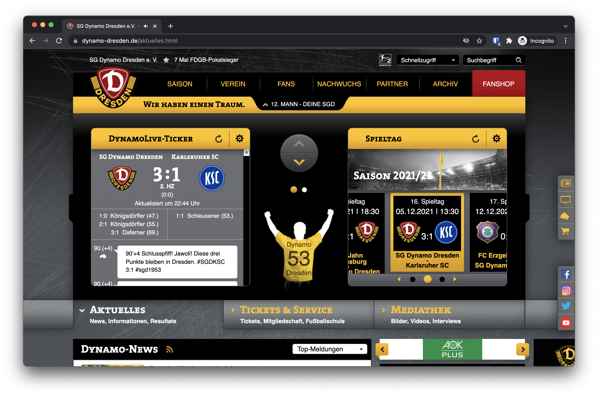

Als technischer Leiter war ich für die Planung verantwortlich. Ich war Teil
des Pitches. Außerdem war ich verantwortlich für Lasttests und
Leistungsverbesserungen.

| Technologische Highlights                |                         |
|------------------------------------------|-------------------------|
| [Varnish][varnish]                       | Reverse Proxy           |
| [Edge Side Includes][edge-side-includes] | Edge Side Includes      |
| [Load Testing][jmeter]                   | Lasttests mit JMeter    |
| [TYPO3][typo3]                           | TYPO3 CMS               |

| Links                                                     |                                                              |
|:----------------------------------------------------------|--------------------------------------------------------------|
| Website                                                   | <https://www.dynamo-dresden.de>                              |
| Chrome Extensions Dynamo                                  | <https://chrome.google.com/webstore/search/dynamo%20dresden> |

## Softwareentwicklung

### [[↑](#projektübersicht)] EDEKA POS Integration

_2023_ - `now()`

Der Kunde beauftragte die Gebit mit der Integration der Kassenlösung in die 
EDEKA‑Infrastruktur und beauftragte Thinkport als technischen Dienstleister.

Die **Technologie-Highlights** sind **Flutter** für die App‑Entwicklung, 
**Java** für die Backend‑Entwicklung und **Docker** für die Bereitstellung der
Anwendung. **OpenTelemetry** wird für die Observability eingesetzt.

| Technologische Highlights      |                              |
|--------------------------------|------------------------------|
| [Flutter][flutter]             | Frontend‑Entwicklung         |
| [Java][java]                   | Backend‑Entwicklung          |
| [Kubernetes][kubernetes]       | Bereitstellung der Anwendung |
| [OpenTelemetry][opentelemetry] | Observability                |

### [[↑](#projektübersicht)] LEJ Nachbarn App

_2022_

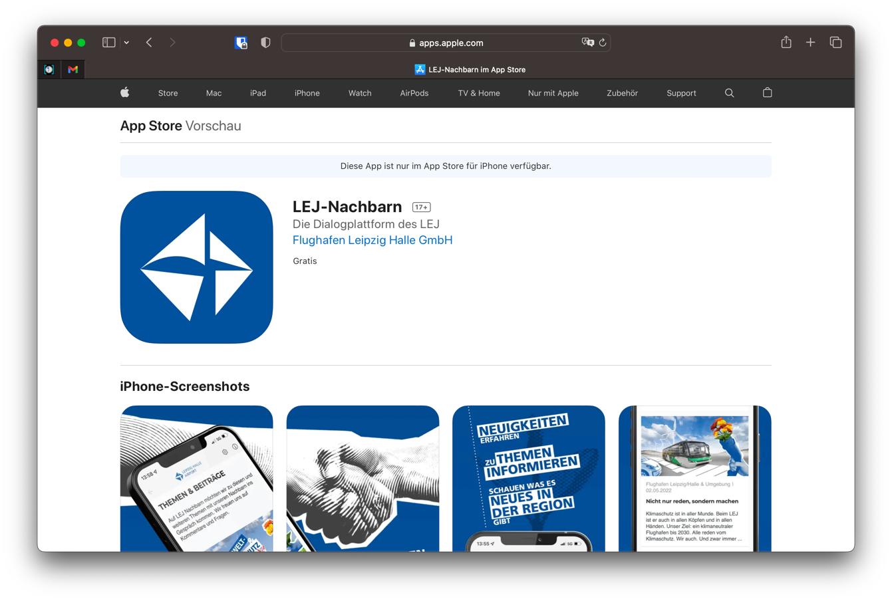

Der Kunde Flughafen Leipzig/Halle suchte eine Möglichkeit, mit seinen direkten
Nachbarn auf digitalem Weg ins Gespräch zu kommen. Mein Part war die Umsetzung
der App‑Variante. **React Native** zeigt hier seine Stärken, da die App für
iOS und Android entwickelt werden konnte und somit die Kosten für die
Entwicklung deutlich gesenkt werden konnten.

Durch das Senden von Push‑Benachrichtigungen können die Nutzer über neue
Nachrichten informiert werden. Die App ist in der Lage, die Benachrichtigungen
auch im Hintergrund zu empfangen und zu verarbeiten.

**Technologie-Highlights:** Ich habe *React Native* mit [Expo][expo]
verwendet, um die App zu erstellen. Ich habe viel über die Richtlinien und
Anforderungen des *Google Play Store* gelernt.

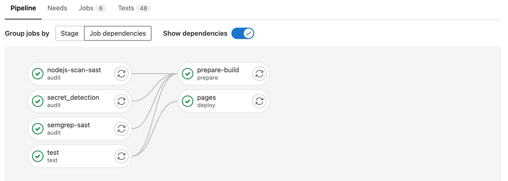

Teil des Projektes war die Erstellung einer CI/CD‑Pipeline. Die Pipeline habe
ich mit GitLab CI erstellt. Sie enthält die folgenden Schritte:

1. Build der App
2. Testen der App
3. Deployment der App auf Expo _(Bereitstellung einer Review‑App bei Merge‑Requests)_
4. Deployment der App auf Google Play Store
5. Deployment der App auf Apple App Store

| Technologische Highlights              |                                  |
|----------------------------------------|----------------------------------|
| [React Native][react-native]           | auf GitLab                       |
| [Expo][expo]                           | zur App‑Entwicklung im Browser   |
| [Google Play Store][google-play-store] | Veröffentlichung der Anwendung   |
| Push‑Benachrichtigungen                | Push‑Benachrichtigungen mit Expo |

| Links             |                                                                        |
|-------------------|------------------------------------------------------------------------|
| Website           | <https://taptap.andrelademann.de>                                      |
| Repository        | <https://github.com/vergissberlin/tap-tap->                            |
| Google Play Store | <https://play.google.com/store/apps/details?id=com.netresearch.portal> |
| Apple AppStore    | <https://apps.apple.com/de/app/lej-nachbarn/id1620877158?uo=4>         |

### [[↑](#projektübersicht)] Tap! Tap!

_2020_

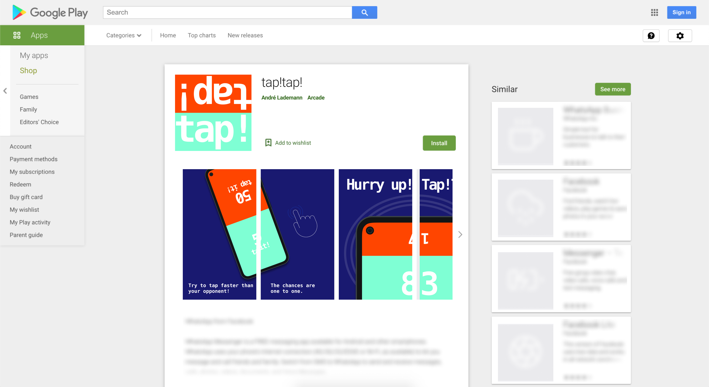

Dies ist ein **React Native** Game‑Experiment. Ein Bildschirm – zwei Spieler. 
Mit jedem Klick auf den Button wird der Button größer und der Button des 
Gegners kleiner. Man gewinnt, wenn der eigene Button die gesamte Spielfläche 
abdeckt. Inspiriert wurde ich von einem Spiel, das wir in der Schule auf 
unseren Taschenrechnern gespielt haben.

**Technologie-Highlights:** Ich habe *React Native* mit [Expo][expo] 
verwendet, um die App zu erstellen. Ich habe viel über die 
Richtlinien/Anforderungen des *Google Play Store* gelernt.

| Technologische Highlights              |                                |
|----------------------------------------|--------------------------------|
| [React Native][react-native]           | auf GitLab                     |
| [Expo][expo]                           | zur App‑Entwicklung im Browser |
| [Google Play Store][google-play-store] | Veröffentlichung der Anwendung |

| Links             |                                                                          |
|-------------------|--------------------------------------------------------------------------|
| Website           | <https://taptap.andrelademann.de>                                        |
| Repository        | <https://github.com/vergissberlin/tap-tap->                              |
| Google Play Store | <https://play.google.com/store/apps/details?id=com.vergissberlin.taptap> |

### [[↑](#projektübersicht)] Bashlight

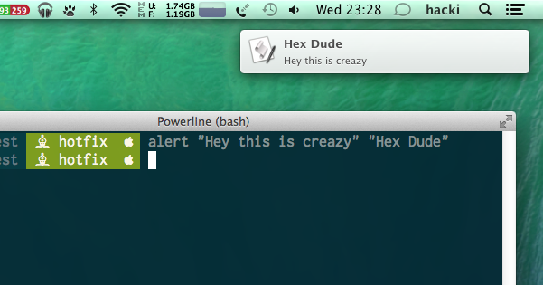

Eine Erweiterung der Kommandozeilen‑Eingabeaufforderung, die unter anderem den 
Git‑Zweig und den Git‑Status anzeigt. Inzwischen gibt es andere, 
bessere Open‑Source‑Projekte zu diesem Thema. Aus diesem Grund habe ich das 
Projekt archiviert.

| Technologische Highlights |                                    |
|---------------------------|------------------------------------|
| [bash scripting][bash]    | Prompt, Git, Testing, Auto‑Update  |

| Links         |                                              |
|---------------|----------------------------------------------|
| Dokumentation | <http://vergissberlin.github.io/bashlight/>  |
| Repository    | <https://github.com/vergissberlin/bashlight> |

### [[↑](#projektübersicht)] regenfass.eu

_2024 – heute_

**regenfass.eu** ist ein IoT-Eigenprodukt für Smart-Home-Anwendungen. Das
Produkt verbindet Hardware-Sensoren mit einer Cloud-basierten Datenplattform
zur Überwachung und Steuerung von Smart-Home-Komponenten.

**Meine Aufgaben:** Produktentwicklung, Softwarearchitektur, IoT-Integration,
Dokumentation.

| Technologische Highlights      |                              |
|--------------------------------|------------------------------|
| IoT / Mikrocontroller          | Hardware-Integration         |
| [OpenTelemetry][opentelemetry] | Observability                |

| Links         |                              |
|---------------|------------------------------|
| Dokumentation | <https://docs.regenfass.eu/> |

---

### [[↑](#projektübersicht)] CoffeeBin

_2020_

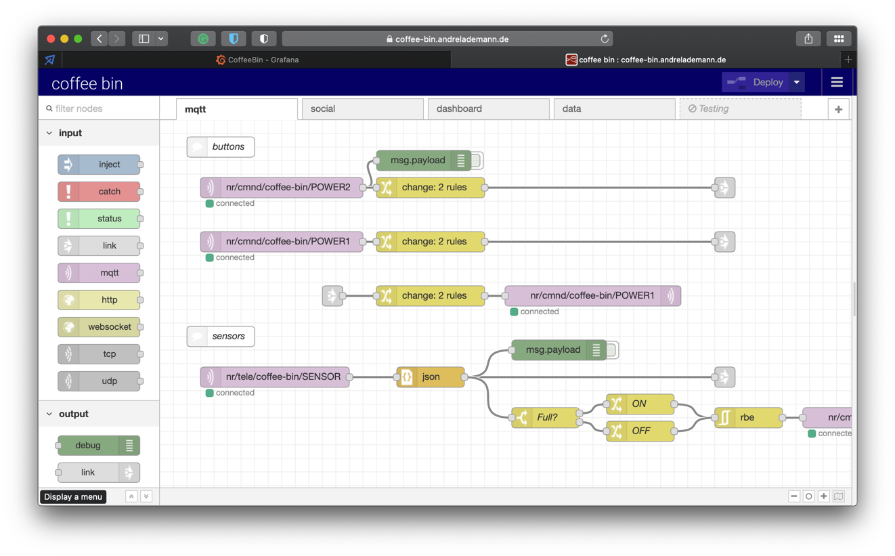

Big‑Data‑Applikation zur Erfassung von Kaffee‑Trink‑Daten bei 
[Netresearch DTT GmbH][netresearch]. Die Daten werden in einer zeitbasierten 
Datenbank gespeichert.
Das Interessante daran ist, welche Schlüsse man aus den zunächst banal 
erscheinenden Daten ziehen kann. Setzt man die Daten in Beziehung zu anderen 
Daten wie der Anzahl der Tickets in JIRA, lässt sich so eventuell ein 
Stresslevel ablesen. Mit dem Fachgebiet der Datenanalyse beschäftige ich mich 
vor allem in meiner Freizeit.

**Technologische Highlights:** Neben der Entwicklung in C++ zur Erfassung der 
Daten kam hier Node‑RED zur Steuerung und Verarbeitung der Datenströme zum 
Einsatz. Die Speicherung erfolgt in der zeitbasierten Datenbank InfluxDB und 
die Visualisierung mit Grafana.

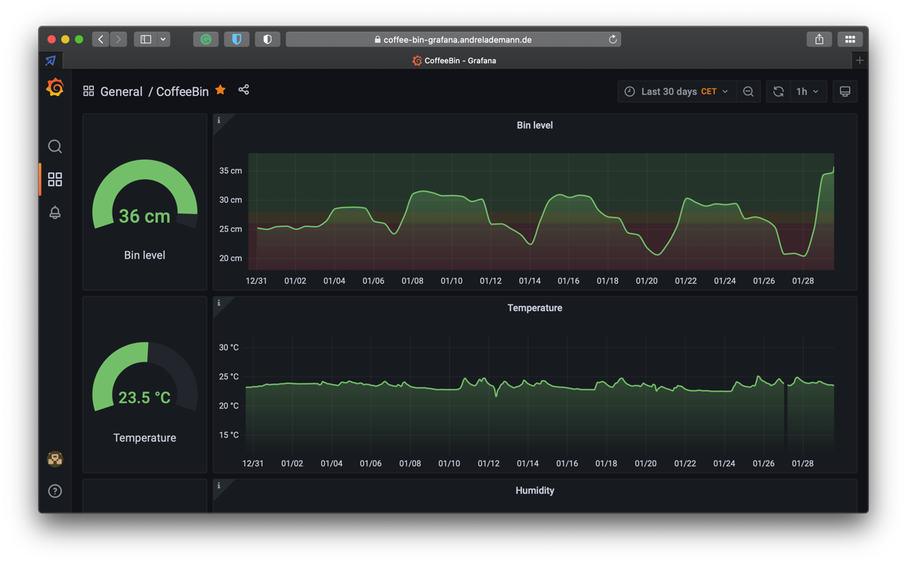

| Technologische Highlights         |                                                                                                      |
|-----------------------------------|------------------------------------------------------------------------------------------------------|
| [Tasmota][tasmota]                | C++ zur Erfassung der Daten                                                                          |
| [Node‑RED][node-red]              | zur Steuerung von Events und Versenden von Nachrichten an Twitter und den firmeninternen Slack‑Chat |
| [InfluxDB][influxdb]              | zeitbasierte Speicherung der Daten                                                                   |
| [Grafana][grafana]                | zur Visualisierung der Daten                                                                         |

### [[↑](#projektübersicht)] CamFight

_2017_

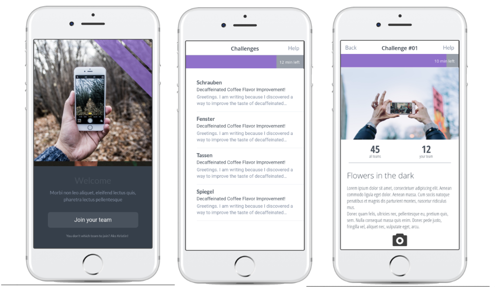

Web‑App erstellt für ein Team‑Event. Es handelt sich um eine digitalisierte Form
einer [Fotorallye](http://www.games-wiki.org/wiki/Photo_rally/). Die
Teilnehmenden werden nach dem Zufallsprinzip einem Team zugewiesen und müssen
innerhalb einer bestimmten Zeit Aufgaben lösen. Das Ergebnis jeder Aufgabe ist
immer ein Foto, das am Ende zur Siegerermittlung dient. Entstanden als
F&E‑Projekt innerhalb einer Woche.

Das Besondere dabei war, dass wir zu zweit nur vier Tage Zeit hatten, um die App
zu realisieren. **Rapid Prototyping** mit Papierprototypen und Figma direkt mit
dem Kunden. **Meine Aufgaben waren** die Erstellung der App, des Frontends, das
Projektmanagement, die Softwarearchitektur und der Kundensupport.

**Technologische Highlights** waren Vue.js im Frontend mit Vuetify als
Komponentenbibliothek, surge.sh als statischer Dateiserver mit Travis CI für die
Deployment‑Automatisierung, eine REST‑API mit PHP‑Backend und Postman als
Dokumentationstool sowie Amazon S3 für Benutzer‑Uploads. Die App war auf
mobilen Geräten installierbar. Derzeit wird sie nicht aktiv weiterentwickelt.

| Technologische Highlights        |                                                   |
|----------------------------------|---------------------------------------------------|
| [Heroku][heroku]                 | Deployment der REST‑API                           |
| [Vue.js][vue.js]                 | Mobile App mit der Vuetify‑Komponentenbibliothek  |
| [Vuetify][vuetify]               | Komponentenbibliothek für Vue.js                  |
| [AWS S3][aws-s3]                 | Zum Upload der Fotos durch die Nutzer             |
| [Travis CI][travis-ci]           | als Pipeline‑Tool für CI/CD                       |
| [Postman][postman]               | API‑Dokumentation                                 |

| Links                            |                                              |
|----------------------------------|----------------------------------------------|
| App                              | <https://cam-fight.surge.sh>                 |
| Repository                       | <https://github.com/vergissberlin/cam-fight> |
| Prototype                        | <https://marvelapp.com/prototype/ahg35jj>    |

### [[↑](#projektübersicht)] Digitaler Agenturkicker

_2015 - 2016_

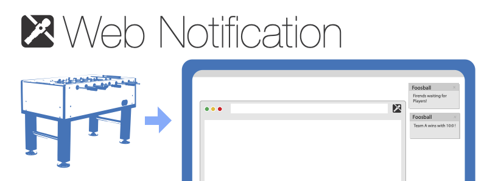
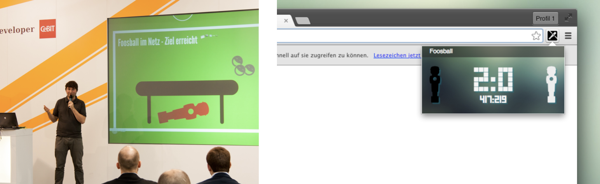

Die Digitalisierung des Agentur‑Kickers ist ein *Multichannel‑Experiment*,
das im Rahmen meiner Research‑&‑Development‑Zeit bei der [Netresearch DTT
GmbH][netresearch] entstanden ist. Ziel war es, möglichst viele Ausspielkanäle
mit einer zentralen Datenbasis zu bedienen. Zusätzliche Herausforderungen waren
hier die Hardwarekomponenten und das Flottenmanagement mit Belana für
„dockerisierte“ Anwendungen. Im Rahmen der Entwicklung habe ich mich mit vielen
neuen Technologien auseinandergesetzt, was mir große Freude bereitete. Das
Projekt unterstreicht mein starkes Interesse an der Entwicklung von Software und
Hardware.

| Technologische Highlights                                 |                                                                                                                                                                    |
|-----------------------------------------------------------|--------------------------------------------------------------------------------------------------------------------------------------------------------------------|
| [Docker][docker]                                          | auf einer ARM‑Architektur                                                                                                                                          |
| [Vue.js][vue.js]                                          | Mobile App mit der Vuetify‑Komponentenbibliothek                                                                                                                  |
| [Python][python]                                          | zum Ansprechen von Hardware‑Komponenten                                                                                                                            |
| [Google Firebase][google-firebase]                        | zur Authentifizierung und Nutzung der Echtzeit‑Datenbank                                                                                                           |
| [Google Chrome Extension][google-chrome-extension-piball] | zur Anzeige der Ergebnisse direkt im Browser und zum Auslösen von Benachrichtigungen. Verfügbar im [Chrome Web Store][google-chrome-extension-piball].            |
| [Ionic Framework][ionic-framework]                        | zur Erstellung einer nativen App für iOS und Android                                                                                                               |
| [Belana.io][belana.io]                                    | Flottenmanagement der dockerisierten Anwendung                                                                                                                    |
| [Node‑RED][node-red]                                      | zur Steuerung von Events und Versenden von Nachrichten an Twitter und den firmeninternen Slack‑Chat                                                               |

[google-chrome-extension-piball]: https://chrome.google.com/webstore/detail/piball/ejahllipniehmpdjkfjmhhadeeamdebh?authuser=1&gclid=Cj0KCQiAqvaNBhDLARIsAH1Pq53cYjAiaEGVxuANGCggDpF6nSdgcij-7fla8VVSs3KuESNg-YiemskaAgZREALw_wcB

| Links                                                     |                                                      |
|-----------------------------------------------------------|------------------------------------------------------|
| Präsentation                                              | <https://prezi.com/khpva--2yv25/foosball/?present=1> |
| GitHub Repository                                         | <https://github.com/vergissberlin/piball>            |
| Web interface                                             | <https://vivid-fire-2266.web.app>                    |

### [[↑](#projektübersicht)] Blugento

_2017 - 2018_

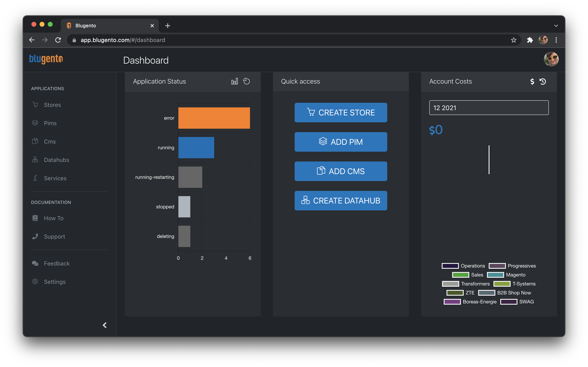

Blugento ist ein Verwaltungssystem für Docker‑Anwendungen. Hiermit ist es 
möglich, auf entfernten Servern Docker‑Images zu starten, zu konfigurieren, 
anzupassen, zu aktualisieren und zu stoppen. Durch die eingebaute Web‑Konsole 
ist es auch möglich, das System aus der Ferne zu debuggen.

Environments können durch die Nutzer verwaltet werden. Die Server können in der 
Cloud oder lokal aufgesetzt werden. Durch ein 
Benutzer‑Rechte‑System ist es möglich, auch Kunden Zugriff auf die Anwendung zu 
gewähren. Mit _blugento_ können im Handumdrehen Demo‑Instanzen 
hochgefahren sowie Systeme für den Live‑Betrieb verwaltet werden.

| Technologische Highlights                                 |                                                                         |
|-----------------------------------------------------------|-------------------------------------------------------------------------|
| [Docker‑API][docker]                                      | Starten und Stoppen von Anwendungen auf Remote‑Systemen                 |
| [Docker‑Registry][docker-registry]                        | selbst gehostet auf GitLab                                             |
| [Docker Compose][docker-compose]                          | für verschiedene Environments                                           |
| [Concourse CI][concourse-ci]                              | als Pipeline‑Tool für CI/CD                                             |
| [GraphQL][graphql]                                        | mit [Apollo.js][apollojs] zur Bereitstellung nutzerbasierter Daten      |
| [Travis CI][travis-ci]                                    | als Pipeline‑Tool für CI/CD                                             |
| [Vue.js][vue.js]                                          | Mobile App mit der Vuetify‑Komponentenbibliothek                        |
| [Autopilot Marketing Automation][autopilot]               | Marketing‑Automatisierung und Nutzerunterstützung                        |
| [Hubspot Marketing Automation][hubspot]                   | Marketing‑Funnel für Beta‑Tester                                        |
| [Sphinx][sphinx]                                          | Bereitstellung einer Dokumentation                                      |

| Links                                                     |                            |
|-----------------------------------------------------------|----------------------------|
| Website                                                   | <https://blugento.com>     |
| App                                                       | <https://app.blugento.com> |

## DevOps

### [[↑](#projektübersicht)] Universal Music – Shop Manager

_2018-2019_

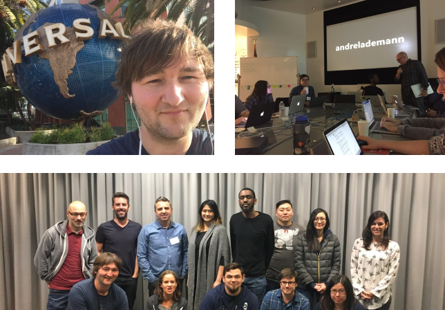

Mit der entwickelten Software ist es dem Kunden UMG möglich, umgehend neue 
Magento‑Webshops für seine Klienten aufzusetzen und zu gestalten, ohne dafür 
Entwickler beauftragen zu müssen.

Innerhalb eines internationalen Teams (Australien, USA, Indien) war ich für das 
Release‑Management des von mir verwalteten Docker‑Basis‑Images für die 
[UMG][umg]‑Shops verantwortlich. Ich stellte dem Kunden und dem Team eine 
eigene Version des Images mit einer eigenen Softwarebasis bereit. Diese Software 
basiert auf [Docker Compose][docker-compose] und wurde mit einer eigenen 
Docker‑Registry verwaltet. Die stetige Weiterentwicklung des dabei verwendeten 
Docker‑Images gehörte zu meinen Aufgaben.

Ich gab dem Team und dem Kunden Schulungen zur Verwendung der entwickelten 
Software.

| Technologische Highlights          |                                    |
|------------------------------------|------------------------------------|
| [Docker‑Registry][docker-registry] | auf GitLab                         |
| [Docker Compose][docker-compose]   | für verschiedene Environments      |
| [AWS ECS][aws-ecs]                 | für das Container‑Deployment       |
| [AWS EC2][aws-ec2]                 | für das Container‑Deployment       |
| [AWS EFS][aws-efs]                 | zum verteilten Speichern von Daten |
| [AWS RDS][aws-rds]                 | zum Datenbank‑Deployment           |
| [Concourse CI][concourse-ci]       | als Pipeline‑Tool für CI/CD        |

| Links                              |                                  |
|------------------------------------|----------------------------------|
| Universal Music Group              | <https://www.universalmusic.com> |

## [[↑](#projektübersicht)] Weitere Projekte

… auf die ich stolz bin.

| Projekt                  |                                                   |
|:-------------------------|:--------------------------------------------------|
| Node‑RED mjml            | Node‑RED‑Node zur Gestaltung von E‑Mail‑Templates |
| Node‑RED say             | Node‑RED‑Node zur Ausgabe von Sprachnachrichten   |

[apollojs]: https://www.apollographql.com/

[autopilot]: https://www.autopilot.io/

[aws-ecs]: https://docs.aws.amazon.com/AmazonECS/latest/developerguide/ECS_Basics.html

[aws-ec2]: https://docs.aws.amazon.com/AWSEC2/latest/UserGuide/ec2-instance-types.html

[aws-efs]: https://docs.aws.amazon.com/efs/latest/ug/

[aws-rds]: https://docs.aws.amazon.com/AmazonRDS/latest/UserGuide/CHAP_MySQL.html

[aws-s3]: https://aws.amazon.com/s3/

[bash]: https://www.gnu.org/software/bash/

[belana.io]: https://belana.io/

[concourse-ci]: https://docs.concourse.ci/

[docker]: https://www.docker.com/

[docker-compose]: https://docs.docker.com/compose/

[docker-registry]: https://docs.docker.com/registry/

[edge-side-includes]: https://en.wikipedia.org/wiki/Edge_Side_Includes

[expo]: https://expo.dev/

[fastify]: https://www.fastify.io/

[google-chrome-extension]: https://chrome.google.com/webstore/detail/google-chrome-extension-for-t/nmmhkkegccagdldgiimedpiccmgmiednk

[google-chrome-extension-dynamo]: https://chrome.google.com/webstore/search/dynamo

[google-firebase]: https://firebase.google.com/

[google-play-store]: https://play.google.com/store/apps/details?id=com.example.taptap

[graphql]: https://graphql.org/

[grafana]: https://grafana.com/

[heroku]: https://dashboard.heroku.com/apps/camfight-app

[hubspot]: https://www.hubspot.com/

[kubernetes]: https://kubernetes.io/

[influxdb]: https://influxdb.com/

[ionic-framework]: https://ionicframework.com/

[jmeter]: https://jmeter.apache.org/

[jspdf]: https://parall.ax/products/jspdf

[netresearch]: https://www.netresearch.de/

[node-red]: https://nodered.org/

[openapi]: https://swagger.io/specification/

[postman]: https://www.getpostman.com/

[python]: https://www.python.org/

[react-native]: https://reactnative.dev/

[sphinx]: https://www.sphinx-doc.org/

[tasmota]: https://tasmota.github.io/docs/

[travis-ci]: https://travis-ci.org/

[typo3]: https://typo3.org/

[umg]: https://www.universalmusic.com/

[vue.js]: https://vuejs.org/

[varnish]: https://www.varnish-cache.org/

[vuetify]: https://vuetifyjs.com/

[datadog]: https://www.datadoghq.com/

[opentelemetry]: https://opentelemetry.io/

[jaeger]: https://www.jaegertracing.io/

[prometheus]: https://prometheus.io/

[kieksme]: https://kieks.me/

[typescript]: https://www.typescriptlang.org/

